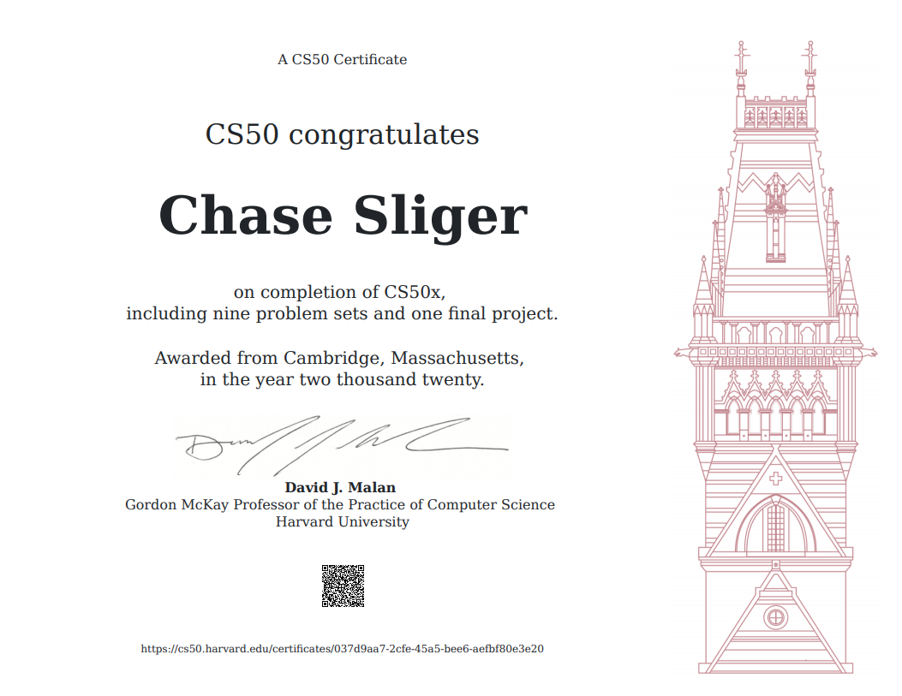

# CS50_Intro
Code for solutions and final project for Harvard's CS50 Introduction to Computer Science course

I made this repository to document my solutions to all the problem sets in Harvard's CS50 Introduction to Computer science class.

If you are going through the CS50 course, please do not view my solutions as it is a violation of the [**Academic Honesty**](https://cs50.harvard.edu/x/2020/syllabus/) policy of the class.

A copy of my [**verified certificate**](https://courses.edx.org/certificates/e8e2e2c218a94e4fb5df49dbf7da96f9)

